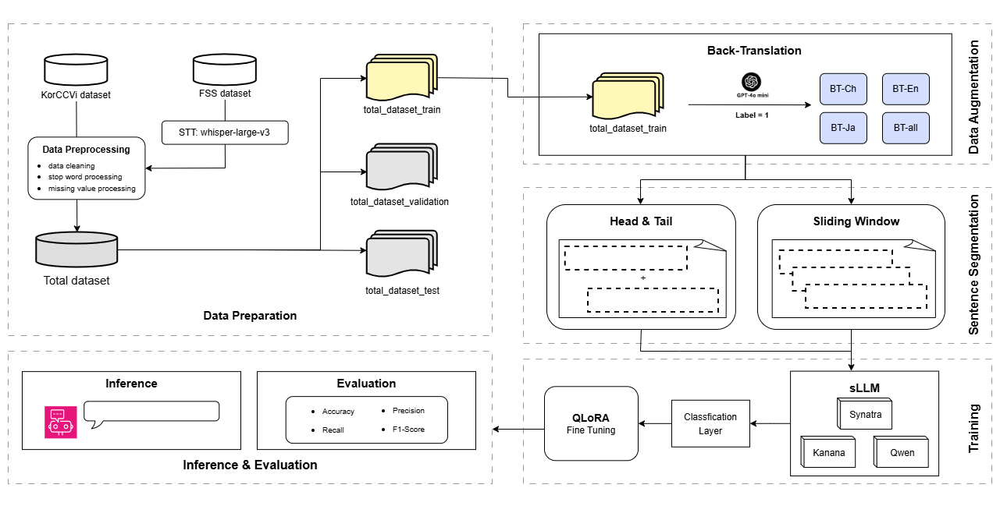

# 🚀 Efficient Korean Voice-Phishing Detection using QLoRA-tuned Small Language Models (SLMs)

## 💡 Project Overview

Responding to the increasing sophistication of voice-phishing crimes, this project establishes an **efficient and accurate** automated detection system. We overcome the limitations of conventional **LLM-based approaches**, such as prohibitive computational costs, by proposing an optimized training framework based on **Small Language Models (SLMs)**.

### Three Core Contributions
* **1. Maximizing Memory Efficiency:** Application of **QLoRA** to models like Synatra, Kanana, and Bllossom for memory-efficient 4-bit fine-tuning.
* **2. Mitigating Data Imbalance:** Enhanced generalization through **Multilingual Back-Translation (BT-ALL)**, improving minority class detection.
* **3. Long Context Processing:** Implementation of an **Overlapping Sliding Window** strategy to minimize context loss in long conversational transcripts.

---

## 🏗️ Architecture Pipeline



The following diagram illustrates the complete workflow from data preparation to training and evaluation.

### 1. 💾 Data Preparation & Augmentation

* **Dataset Construction:** We constructed a Korean voice-phishing text dataset by transcribing publicly available audio files from **KorCCVi** and the **Financial Supervisory Service (FSS)** using **Whisper-large-v3**.
* **Back-Translation (BT):** To augment the scarce phishing data compared to normal conversations, we applied **Multilingual BT**, which translates Korean text into languages such as **English, Chinese, and Japanese** and then translates it back to Korean.
    > **Result:** The **BT-ALL** strategy consistently improved the performance of all models. Notably, the F1-Score of the Qwen model saw a substantial increase from **0.2581 to 0.6213**.

### 2. ✂️ Text Segmentation Strategy

We compared three segmentation strategies for processing long conversational texts that exceed the maximum input length of SLMs.

| Strategy | Description | F1-Score (Synatra) |
| :--- | :--- | :--- |
| **Baseline** | Uses the tokenizer's default truncation function. | 0.9745 |
| **Head & Tail** | Segmentation based on the hypothesis that key phishing information is concentrated at the beginning and end. | 0.9734 |
| **Sliding Window (SW-512)** | Segmentation into fixed-length chunks with **25% overlap** to minimize context loss. | **0.9875** |

* **Optimal Result:** The **Sliding Window (SW-512)** strategy showed the best performance. This suggests that the context embedded in the intermediate sections of the conversation plays a crucial role in detection, contrary to the simple hypothesis that key information is concentrated only at the beginning and end.

---

## 🧠 sLLM Training & Optimization

### Model Selection and QLoRA Application
* **Models:** We selected **Synatra (1.3B)**, **Kanana (2.1B)**, and **Qwen (0.5B)** based on criteria: decoder-only architecture, parameter count below 3B, and strong Korean language comprehension.
* **QLoRA:** We quantized the weights of the pre-trained model to **4-bit precision** and applied the **LoRA** module to the primary attention layers, significantly reducing memory consumption during training.

---

## 📈 Key Quantitative and Qualitative Results

### 1. Quantitative Performance Comparison

The proposed integrated framework (using **BT-ALL** and **SW-512**) demonstrated performance that significantly surpassed conventional Machine Learning and PLM (KOBERT) based models.

| Category | Model | F1-Score |
| :--- | :--- | :--- |
| Proposed SLLM | **Synatra** | **0.9938** |
| Proposed SLLM | **Kanana** | **0.9938** |
| PLM (Baseline) | KOBERT | 0.6433 |
| ML Models | Random Forest | 0.9835 |

### 2. Qualitative Interpretability

We verified the **Interpretability**, a primary motivation for employing SLMs.
* **Synatra/Kanana:** Consistent with their high F1-Scores, these models accurately identified core phishing patterns, such as **'impersonation of authority'** and **'induction of urgency'**, and provided reasonable rationales for their classification decisions. Kanana, in particular, offered interpretations in a structured format, including an analysis overview, decision rationale, and conclusion.
* **Qwen:** Qwen, which recorded the lowest F1-Score, failed to comprehend the phishing context and exhibited **'Hallucination'**, generating inaccurate results and rationales.

---

## 🧑‍💻 Getting Started

### 1. Repository Clone
```bash
git clone [https://github.com/junhoeKu/Voice-Phishing-Detection](https://github.com/junhoeKu/Voice-Phishing-Detection)
cd Voice-Phishing-Detection
